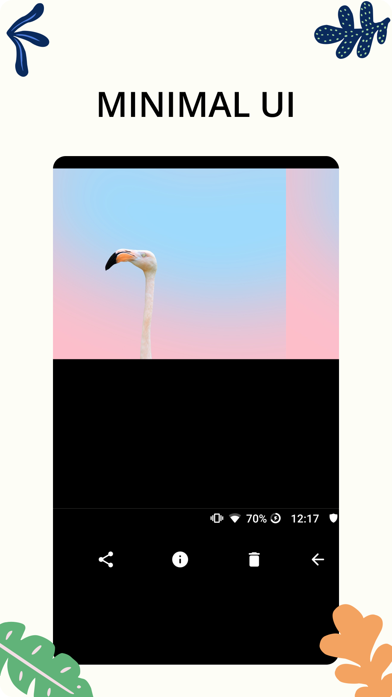
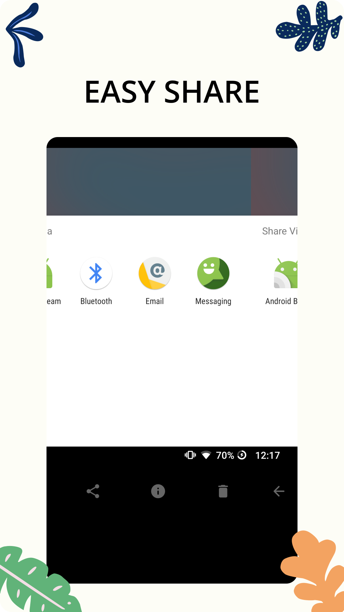

# Material Gallery

  

## 💡 Introduction
Material Gallery is a project that aims to be up to date to latest [Material guidelines](https://m3.material.io/) with beautiful UI and stunning animations

## 🌟 Features

Material Gallery brings you a beautiful gallery that allows you to view all your media!

Share your photos with a comprehensive app that has it all. View images in the photo gallery to look at your works of art.

Material Gallery supports many types of files, from JPEGs to PNGs, GIFs and more. Photo & video files are supported within the app. Share photos without worry - any file you need, you can create. Photo sharing is as easy with Material Gallery as it is with your phone gallery.

MATERIAL GALLERY FEATURES:

- Convert Images to PDF

- Share Your Media
    - Media share simply and easily

- Manage File Formats
    - Material Gallery supports many different file types
    - JPEG, PNG, MP4, MKV, RAW, SVG, GIF and more
    - Photo & video files are supported
